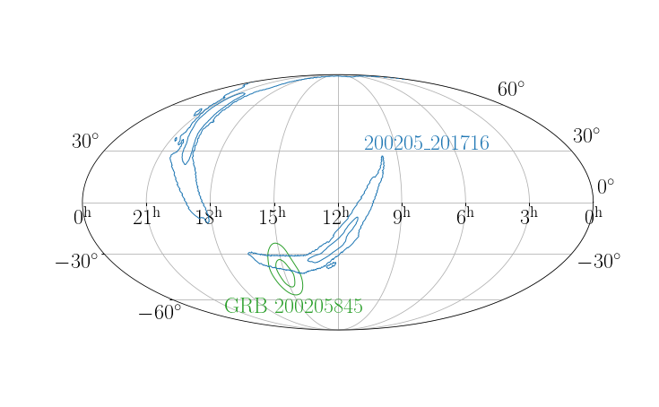

# Search for Coincident Gravitational Wave and Long Gamma-Ray Bursts from 4-OGC and the Fermi/Swift Catalog
[Yi-Fan Wang（王一帆)](http://yi-fan-wang.github.io)<sup>1,2</sup>, Alexander H. Nitz <sup>1,2</sup>, Collin D. Capano <sup>3,1,2</sup>, Xiangyu Ivy Wang <sup>4, 5</sup>, Yu-Han Yang <sup>4, 5</sup> and Bin-Bin Zhang <sup>4, 5</sup>

<sub>1. [Albert-Einstein-Institut, Max-Planck-Institut for Gravitationsphysik, D-30167 Hannover, Germany](http://www.aei.mpg.de/obs-rel-cos)</sub>  
<sub>2. Leibniz Universitat Hannover, D-30167 Hannover, Germany</sub>  
<sub>3. Department of Mathematics, University of Massachusetts, Dartmouth, MA 02747, USA</sub>  
<sub>4. School of Astronomy and Space Science, Nanjing University, Nanjing 210093, China</sub>  
<sub>5. Key Laboratory of Modern Astronomy and Astrophysics (Nanjing University), Ministry of Education, China</sub>  
  
## Introduction
The recent discovery of a kilonova associated with an apparent long-duration gamma-ray burst has challenged the typical classification that long gamma-ray bursts originate from the core collapse of massive stars and short gamma-ray bursts are from compact binary coalescence. 
The kilonova indicates a neutron star merger origin and suggests the viability of gravitational-wave and long gamma-ray burst multimessenger astronomy. Gravitational waves play a crucial role by providing independent informa- tion for the source properties. 
This work revisits the archival 2015-2020 LIGO/Virgo gravitational-wave candidates from the 4-OGC catalog which are consistent with a binary neutron star or neutron star- black hole merger and the long-duration gamma-ray bursts from the Fermi and Swift catalogs. 
We search for spatial and temporal coincidence with up to 10 s time lag between gravitational-wave candi- dates and the onset of long-duration GRBs. The most significant candidate association has only a false alarm rate of once every two years; given the LIGO/Virgo observational period, this is consistent with a null result. 
We report an exclusion distance for each search candidate for a fiducial gravitational-wave signal and conservative viewing angle assumptions.

## Paper Link

[Arxiv Preprint](https://arxiv.org/abs/2208.03279)

[Published version in Astrophysical Letter (open access)](https://iopscience.iop.org/article/10.3847/2041-8213/ac990c)

## Skymap of the No. 1 candidate



## Data Release: Skymaps for Subthreshold Candidates

See [gwskymap](https://github.com/gwastro/gw-longgrb/tree/master/gwskymap) for data release, and [this notebook](https://github.com/gwastro/gw-longgrb/blob/master/gwskymap/how-to-use.ipynb) for how to use.

## Erratum: Note on Exclusion Distance Calculation

An earlier version of `exclusion-distance.py` contained a typo in the waveform parameters: `inlication` was used instead of `inclination` (as in this [line](https://github.com/gwastro/gw-longgrb/blob/8d563fb963925555c985a3ca5b449a94ac899ce4/exclusion-distance.py#L133)). As a result, the intended fiducial inclination angle of 30 deg was not passed to the waveform generator, and the exclusion distances were effectively computed with a face-on inclination, iota = 0 (the default value is 0, as shown [here](https://github.com/gwastro/pycbc/blob/master/pycbc/waveform/parameters.py#L410)).

For leading order, inclination dependence of the two gravitational-wave polarizations is

```text
h proportional to [(1 + cos^2 iota) / 2] h_+ + [cos iota] h_x .
```

Thus, relative to the face-on case, the plus and cross amplitude factors at iota = 30 deg are

```text
A_+(30 deg) = (1 + cos^2 30 deg) / 2 = 0.875,
A_x(30 deg) = cos 30 deg = 0.866,
```

while `A_+(0) = A_x(0) = 1`. For a hand-waving estimation

```text
rho(30 deg) / rho(0)
  ~= sqrt[(0.875^2 + 0.866^2) / (1^2 + 1^2)]
  ~= 0.871.
```

The exclusion distance scales linearly with the optimal SNR, so the corrected 30 deg exclusion distance is approximately `0.87` times the face-on value, or equivalently the face-on exclusion distances were overestimated by approximately 15% relative to the corrected 30 deg calculation.

We thank Samuele Ronchini, Ansh Chopra and Tito Dal Canton for pointing this out.

## License and Citation


This work is licensed under a [Creative Commons Attribution-ShareAlike 3.0 United States License](http://creativecommons.org/licenses/by-sa/3.0/us/).

We encourage use of these data in derivative works. If you use the material provided here, please cite the paper using the reference:

```
@article{Wang:2022pbt,
    author = "Wang, Yi-Fan and Nitz, Alexander H. and Capano, Collin D. and Wang, Xiangyu Ivy and Yang, Yu-Han and Zhang, Bin-Bin",
    title = "{Search for Coincident Gravitational Waves and Long Gamma-Ray Bursts from 4-OGC and the Fermi-GBM/Swift-BAT Catalog}",
    eprint = "2208.03279",
    archivePrefix = "arXiv",
    primaryClass = "astro-ph.HE",
    doi = "10.3847/2041-8213/ac990c",
    journal = "Astrophys. J. Lett.",
    volume = "939",
    number = "1",
    pages = "L14",
    year = "2022"
}
```
